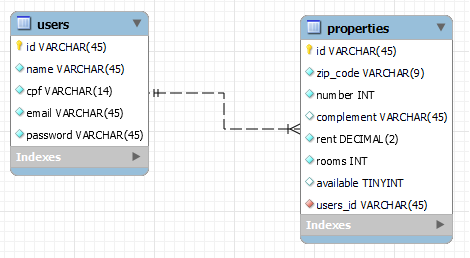

<h1 align="center">
  Loomer Imóveis 🏚️
</h1>

<h2 align="center">
  Desafio para a vaga de estágio na Loomer Tech
</h2>

<ul>
  <li><a href="#wrench-tecnologias">Tecnologias utilizadas</a></li>
  <li><a href="#memo-licença">Licença</a></li>
  <li><a href="#floppy_disk-banco-de-dados">Estrutura do Banco de Dados</a></li>
  <li><a href="#runner-rodando-localmente">Rodando o Projeto Localmente</a></li>
</ul>

## :wrench: Tecnologias

Esse projeto foi desenvolvido com as seguintes tecnologias:

- [Node.js](https://nodejs.org/en/)
- [TypeScript](https://www.typescriptlang.org/)
- [Yarn](https://yarnpkg.com/)
- [Git](https://git-scm.com/)
- [Express](https://expressjs.com/pt-br/)
- [PostgreSQL](https://www.postgresql.org/)
- [TypeORM](https://typeorm.io/#/)
- [bcrypt.js](https://www.npmjs.com/package/bcryptjs)

## :memo: Licença 

Este projeto está sob a licensa MIT. Veja a [LICENSE](LICENSE) para mais informações.

## :floppy_disk: Banco de dados

## :runner: Rodando localmente

Feito com ♥ por David Lima [Venha me conhecer!](https://www.linkedin.com/in/antdavidlima/)
